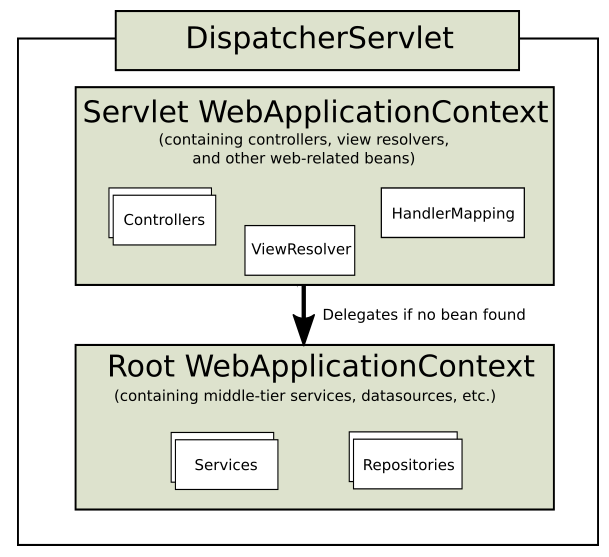
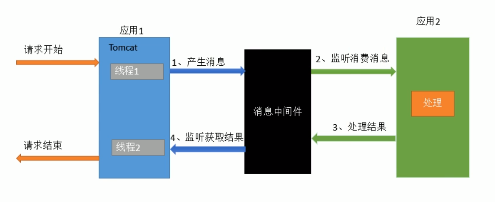

# SpringMVC构建及原理
[SpringMVC官方文档](https://docs.spring.io/spring-framework/docs/current/reference/html/web.html)

### 传统方法的web.xml配置文件
```xml
    <web-app>
    
        <listener>
<!--            使用该监听器加载Spring的配置(下面的app-context.xml)来启动Spring的容器(称为父容器或者根容器)-->
            <listener-class>org.springframework.web.context.ContextLoaderListener</listener-class>
        </listener>
    
        <context-param>
            <param-name>contextConfigLocation</param-name>
            <param-value>/WEB-INF/app-context.xml</param-value>
        </context-param>
    
        <servlet>
            <servlet-name>app</servlet-name>
<!--            配置DispatcherServlet，指定SpringMVC配置文件的位置(由<param-value>指定)-->
            <servlet-class>org.springframework.web.servlet.DispatcherServlet</servlet-class>
            <init-param>
                <param-name>contextConfigLocation</param-name>
                <param-value></param-value>
            </init-param>
            <load-on-startup>1</load-on-startup>
        </servlet>
    
        <servlet-mapping>
<!--            配置映射-->
            <servlet-name>app</servlet-name>
            <url-pattern>/app/*</url-pattern>
        </servlet-mapping>
    
    </web-app>
```

1. 容器在启动时，会扫描当前应用的每一个jar包里面的META-INF/services/javax.servlet.ServletContainerInitializer
       指定的实现类，启动并运行这个实现类(SpringMVC中这个类是SpringServletContainerInitializer)
2. 该类一启动就会加载感兴趣的WebApplicationInitializer接口下的所有组件webAppInitializerClasses
3. 为这些组件WebApplicationInitializer创建对象(不是接口和抽象类的组件):
    * WebApplicationInitializer接口的3个抽象子类：
        * AbstractContextLoaderInitializer(implements WebApplicationInitializer)
            1. onStartup(ServletContext) -> registerContextLoaderListener(ServletContext)
                创建根容器WebApplicationContext rootAppContext = createRootApplicationContext();
                将rootAppContext放入ContextLoaderListener，并将listener放入到servletContext，以实现利用listener创建根容器的目的
        * AbstractDispatcherServletInitializer(extends AbstractContextLoaderInitializer)
            1. onStartup(ServletContext) -> registerDispatcherServlet(ServletContext)
                * 创建一个web的ioc容器WebApplicationContext servletAppContext = this.createServletApplicationContext();
                * 创建了一个DispatcherServlet:FrameworkServlet dispatcherServlet = this.createDispatcherServlet(servletAppContext) -> new DispatcherServelt();
                * 将DispatcherServlet添加到ServletContext，并做一些必要的设置
        * AbstractAnnotationConfigDispatcherServletInitializer(extends AbstractDispatcherServletInitializer): 注解方式配置的DispatcherServlet初始化器
            * 重写了创建根容器的方法：createRootApplicationContext():
                1. 获取一个配置类
                2. 创建一个AnnotationConfigWebApplicationContext
                3. 注册配置类
    若要以注解方式来启动SpringMVC：继承AbstractAnnotationConfigDispatcherServletInitializer
    实现抽象方法指定DispatcherServlet的配置信息，例如：
    ``` java
        // web容器初始化的时候创建对象，调用方法来初始化容器以及前端控制器
        public class MyWebAppInitializer extends AbstractAnnotationConfigDispatcherServletInitializer {
            
            // 获取根容器的配置类(就是之前的Spring的配置文件) 父容器，__@ComponentScan不扫描所有的controller__
            @Override
            protected Class<?>[] getRootConfigClasses() {
                return new Class<?>[] { RootConfig.class };
            }
            // 获取web容器的配置类(之前的SpringMVC的配置文件) 子容器, __@ComponentScan只扫描所有的controller__
            @Override
            protected Class<?>[] getServletConfigClasses() {
                return new Class<?>[] { App1Config.class };
            }
        
            // 获取DispatcherServlet的映射信息
            @Override
            protected String[] getServletMappings() {
                // 若返回"/*": 拦截所有请求，包括*.jsp: jsp页面是tomcat引擎解析的
                return new String[] { "/" };   // 拦截所有请求(包括静态资源js、png，但是不包括jsp)
            }
        }
    ```
    
    * ### SpringMVC推荐的容器结构
        
        * ### 采用父子容器的方式
            * ServletAppContext: 只包含Controller、视图解析器等和web相关的组件
            * RootAppContext: 扫描Service、DataSource等


### 具体构建：
1. 创建MyWebAppInitializer extends AbstractAnnotationConfigDispatcherServletInitializer(如上)
2. 分别创建根容器的配置类RootConfig和web容器配置类AppConfig：
    * RootConfig: 不扫描所有的controller(父容器)
    * AppConfig: 只扫描所有的controller(子容器)
3. 写业务：创建controller、service、repository、...

***

# 定制(配置)SpringMVC (文档中1.11 MVC CONFIG部分)
1. 使用注解@EnableWebMvc：开启SpringMVC定制配置功能(一般在AppConfig上标注)
    * 相当于配置文件中的：<mvc:annotation-driven />
2. 配置组件(视图解析器、视图映射、静态资源映射、拦截器、...)
    * 让AppConfig实现WebMvcConfiger接口并实现他的定制方法以实现定制功能
    * WebMvcConfiger接口中的方法较多，我们一般不会全部定制，因此，一般使用WebMvcConfigerAdapter(为WebMvcConfiger接口所有定制方法提供了空的实现)
    然后只重写需要定制的方法(结合文档对应部分进行配置)
    * 例如：
        * 视图解析器
        ``` java
            // 视图解析器(类似Springboot中制定template模板的前缀和后缀)
            @Override
            public void configureViewResolvers(ViewResolverRegistry registry) {
                // 默认所有的页面都从/WEB/INF/*.jsp寻找
                // registry.jsp();
        
                // 或者自己制定规则
                registry.jsp("/WEB/INF/", ".jsp");
            }
        ```
        * 静态资源访问(相当于<mvc:default-servlet-handler />)(SpringMVC无法处理静态资源的访问，因此交由默认处理(Tomcat进行处理))
        ``` java
            // 静态资源访问
            @Override
            public void configureDefaultServletHandling(DefaultServletHandlerConfigurer configurer) {
                configurer.enable();
            }
        ```
        * 拦截器(相当于<mvc:interceptors></mvc:interceptors>)
        ``` java
            // 拦截器
            @Override
            public void addInterceptors(InterceptorRegistry registry) {
                registry.addInterceptor(interceptor).addPathPatterns("/**");
            }
        ```
    
    
# 异步处理(基于Servlet3)
1. 返回Callable方式：
    * 在@Controller中：
        ``` java
            @ResponseBody
            @RequestMapping("/async01")
            public Callable<String> async01() {
                System.out.println("主线程开始。。"+Thread.currentThread()+"==>"+System.currentTime());
                Callable<String> callable = new Callable<String>(){
                    @Override
                    public String call() throws Exception {
                        System.out.println("副线程开始。。"+Thread.currentThread()+"==>"+System.currentTime());   
                        Thread.sleep(2000);
                        System.out.println("副线程结束。。"+Thread.currentThread()+"==>"+System.currentTime());
                        return "callable async...";
                    }
                };
                System.out.println("主线程结束。。"+Thread.currentThread()+"==>"+System.currentTime());
            }
        ```
    * Callable中的返回值就是目标方法的返回值
    * 处理流程：
        1. Controller返回Callable
        2. Spring在一个隔离的线程进行异步处理：将Callable提交到TaskExecutor
        3. DispatcherServlet和所有的Filter退出web容器的线程，但是__response依然保持打开__
        4. Callable返回结果，SpringMVC将请求重新派发给容器，恢复之前的处理(请求的response还打开着，可以返回结果)
        5. 根据Callable返回的结果，SpringMVC继续进行视图渲染流程等(收请求->视图渲染)
    * 以上代码打印结果：
        ```
        preHandle..
        主线程开始。。Thread[http-bio-8081-exec-3,5,main]==>1513932494700
        主线程结束。。Thread[http-bio-8081-exec-3,5,main]==>1513932494700
        副线程开始。。Thread[MvcAsync1,5,main]==>1513932494707
        副线程结束。。Thread[MvcAsync1,5,main]==>1513932496708
      
        preHandle...
        postHandle...
        afterCompletion...
      ```
      ###### 打印结果中的preHandle..、postHandle...和afterCompletion...是拦截器在不同的时机拦截并打印时机
      * __可以看到这里的主副线程不在同一个线程池__
      * __特别注意：这里会异步请求会受到两次请求(两次preHandle...)__
      
    * 异步的listener：
        * servlet原生的异步listener：实现AsyncListener
        * SpringMVC：实现AsyncHandlerInterceptor
        
2. DeferredResult (考虑到一下实际情况，结合消息中间件使用)
    
    * 在@Controller中：
        ``` java (接受请求部分)
            @ResponseBody
            @ReuqestMapping("/createOrder")
            public DeferredResult<Order> createOrder() {
                DeferredResult<Order> deferredResult = new DeferredResult<>(3000, null); // 3秒钟超时，返回默认对象(这里指定为null)
                // 将deferredResult放入消息中间件，让别的线程进行处理
                deferredResultQueue.add(deferredResult);
                return deferredResult;
            }
        ```
        ``` java (订单创建部分)
            Order order = new Order();
            DeferredResult<Order> deferredResult = deferredResultQueue.get();
            // 创建订单后将订单放入deferredResult
            deferredResult.setResult(order);
        ```
      
      在执行完deferredResult.setResult(order);后会将结果返回给用户